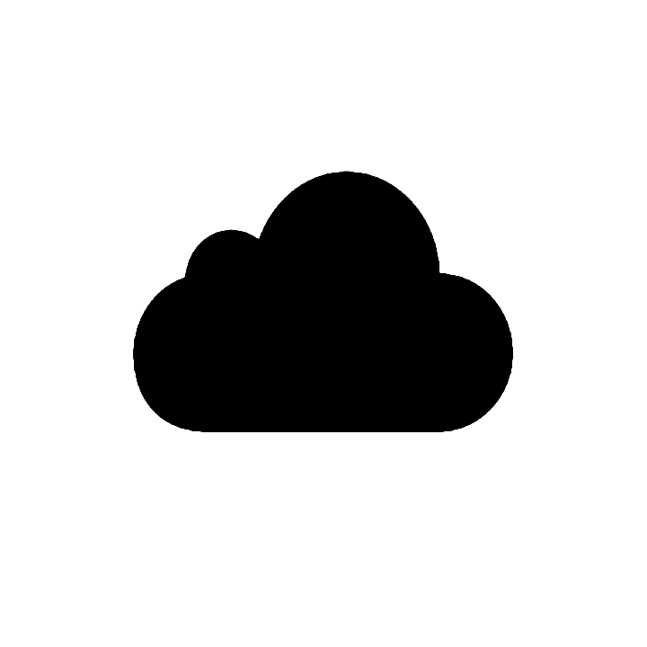

# nimbus
Nimbus is a scaling cloud application that takes advantage of the considerable amount of CVE data published each day to ultimately simplify the process of historically analysing the most severe vulnerabilities based on keyword association.

## Services used
### CIRCL CVE API
The main source of raw data for Nimbus is the Computer Incident Response Center Luxembourg’s (CIRCL) public web interface to the open source tool cve-search. This tool collects data from NIST’s National Vulnerability Database and MITRE to provide various information - most importantly, CVE data. This API has no documentation on rate limiting and does not require authentication. 
Endpoint: https://cve.circl.lu/api/   
Docs: https://cve.circl.lu/api/

### Google Cloud’s Natural Language API
Analysis of Nimbus’s raw CVE data is completed by Google Cloud’s entity analysis API. This API has associated costs for each service used and therefore requires credentials.  
Endpoint: https://language.googleapis.com/v1/documents:analyzeSentiment  
Docs: https://cloud.google.com/natural-language/docs

## Deployment
To handle various rates of traffic, Nimbus’ scaling pool sits behind an internet facing load balancer with a metric based on CPU usage exceeding a 20% threshold.

## Instructions
Populate a prod.env file with the environment variables for `REDIS_URL`, and the API keys for Amazon and Google Cloud, then run `docker-compose up`
